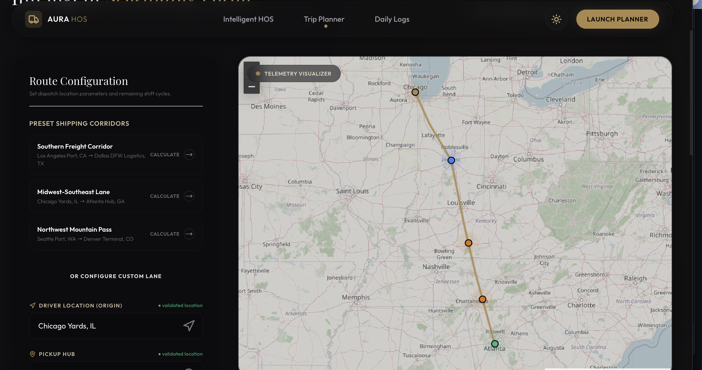
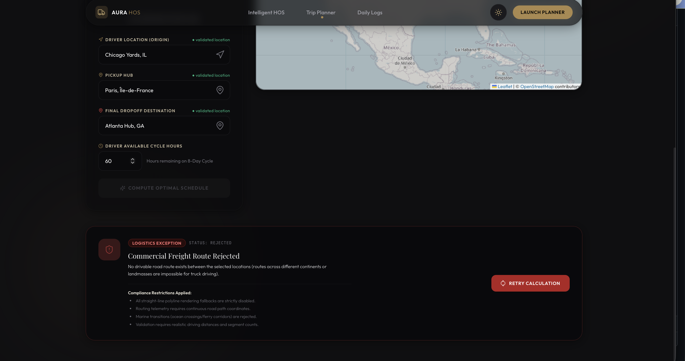
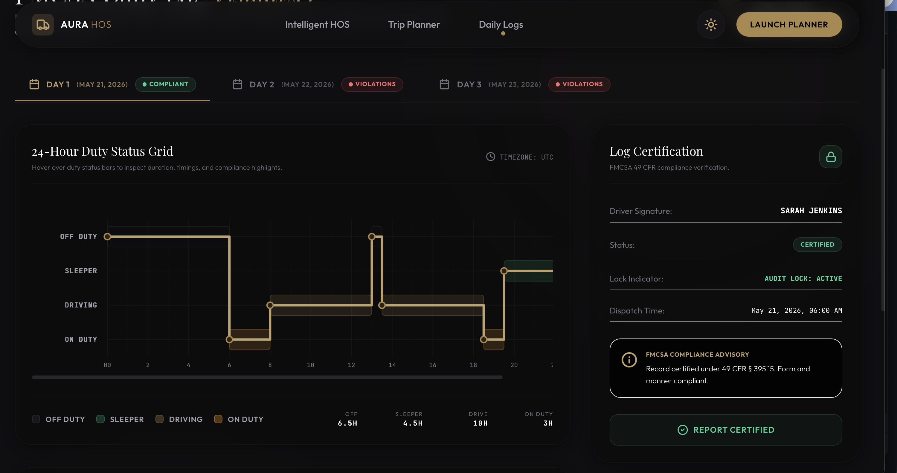

# Aura HOS

AI-assisted trucking dispatch and Hours-of-Service planning platform.

Aura HOS is a logistics planning system designed to simulate commercial freight operations while respecting FMCSA Hours-of-Service constraints. The platform combines route visualization, compliance-aware scheduling, AI-assisted operational support, and route feasibility validation into a unified workflow.

The project focuses on operational realism instead of simple map rendering. The system validates commercial freight lanes, rejects impossible intercontinental routes, and handles routing-provider failures safely.

---

## Live Demo

Frontend Deployment:
https://hos-planner-sigma.vercel.app/planner

GitHub Repository:
https://github.com/Rutva-11/hos-planner

---

## Problem Statement

Most routing demos only visualize shortest paths between two points. Real trucking dispatch systems must also consider:

- FMCSA Hours-of-Service compliance
- driver cycle limitations
- impossible freight lanes
- operational edge cases
- route-provider failures
- dispatch workflow usability

Aura HOS was built to explore how AI-assisted logistics software can provide operationally realistic dispatch planning instead of only visual route geometry.

---

# Core Features

## 1. Intelligent Trip Planner

The trip planner allows dispatch-style freight route simulation between logistics hubs and commercial delivery points.

Features include:
- origin, pickup, and destination configuration
- commercial freight corridor presets
- interactive map visualization
- multi-stop workflow support
- route timeline visualization
- route-state feedback handling

The planner dynamically updates routing information while validating route feasibility.

---

## 2. FMCSA Compliance Simulation

The system includes compliance-aware operational planning tools inspired by FMCSA Hours-of-Service regulations.

Implemented features:
- driver available cycle-hour tracking
- remaining shift calculations
- operational driving-hour simulation
- compliance-oriented workflow structure
- fatigue-aware operational indicators

This helps simulate realistic long-haul freight scheduling constraints.

---

## 3. Route Validation and Edge Case Handling

A major focus of the project was handling invalid commercial freight scenarios.

The platform now:
- rejects impossible intercontinental routes
- prevents ocean-crossing fallback polylines
- validates routing-provider responses
- handles API failures safely
- displays operationally meaningful error states

Instead of always rendering geometry, the system prioritizes operational realism.

Example:
- Los Angeles → Kolkata → Dallas now correctly triggers route rejection logic instead of drawing unrealistic straight-line paths across oceans.

---

## 4. AI-Assisted Logistics Support

Aura HOS includes an AI operational assistant integrated through OpenRouter APIs.

Current capabilities:
- HOS-related guidance
- dispatch workflow support
- compliance-related Q&A
- operational assistance prompts

The assistant architecture is modular and designed for future expansion into:
- predictive dispatch optimization
- automated compliance auditing
- fatigue-risk prediction
- fleet-wide operational intelligence

---

## 5. Daily Logs Dashboard

The Daily Logs module simulates driver operational reporting.

Features include:
- duty status visualization
- compliance-oriented log structure
- operational activity summaries
- driver workflow monitoring UI

The goal was to create a dispatch-style operational dashboard instead of a generic admin panel.

---

# Frontend Architecture

The frontend was designed to resemble modern logistics-dispatch software with a dark operational interface and map-first workflow.

## Frontend Stack

- React
- TypeScript
- Vite
- TailwindCSS
- Leaflet Maps

## Frontend Design Goals

The UI prioritizes:
- operational readability
- dispatch workflow clarity
- map interaction simplicity
- real-time planning feedback
- responsive layout behavior

## Key Frontend Components

### Route Configuration Panel
Handles:
- origin input
- pickup hub selection
- destination configuration
- driver cycle-hour settings

### Interactive Map Layer
Responsible for:
- route rendering
- stop visualization
- logistics corridor display
- route-state updates
- validation feedback

### Timeline and Stop Visualization
The planner includes stop sequencing and route progression visualization to make dispatch workflows easier to interpret operationally.

### Error-State UX
Special focus was given to:
- invalid route handling
- rejected freight lanes
- API fallback scenarios
- compliance-related operational warnings

---

# Backend Architecture

The backend powers:
- route validation
- compliance logic
- AI integrations
- operational fallback handling

## Backend Stack

- Python
- Django
- Django REST Framework
- OpenRouter API
- OpenRouteService API

## Backend Responsibilities

### Route Validation Engine
Validates:
- commercial route feasibility
- routing-provider responses
- impossible lane combinations

### API Safety Handling
The backend safely handles:
- missing geometry
- routing-provider outages
- invalid coordinate chains
- fallback route prevention

### AI Integration Layer
The backend exposes AI-assisted operational workflows through API endpoints connected to OpenRouter.

---

# Engineering Challenges

## 1. Impossible Intercontinental Routing

Initially, fallback logic generated unrealistic straight-line paths across oceans whenever routing providers failed.

This created technically valid geometry but operationally incorrect freight routes.

To solve this:
- continent-aware validation was added
- fallback polyline rendering was disabled
- backend rejection checks were implemented
- frontend operational error states were improved

This was one of the most important engineering improvements in the project.

---

## 2. Frontend-Backend Synchronization

The planner required synchronized handling between:
- map rendering
- route generation
- compliance calculations
- operational states
- backend validation responses

Special attention was given to preventing inconsistent UI states.

---

## 3. Production Deployment Challenges

Deployment introduced:
- CORS configuration issues
- environment variable synchronization
- API-key resolution problems
- frontend/backend communication debugging

The production deployment was stabilized using:
- Render for backend hosting
- Vercel for frontend deployment

---

# Deployment Architecture

## Frontend
Hosted on Vercel

## Backend
Hosted on Render

## Production Setup

The application uses split deployment architecture:

Frontend responsibilities:
- UI rendering
- user interactions
- map visualization

Backend responsibilities:
- route validation
- AI workflows
- operational logic
- compliance calculations

Environment variables are isolated between deployments for security and reliability.

---

# Scalability Considerations

The current architecture is modular and can be expanded into:
- fleet-wide dispatch management
- persistent driver records
- real-time telemetry
- ELD integrations
- predictive fatigue analytics
- dispatch optimization systems
- enterprise logistics dashboards

The backend APIs were intentionally designed independently from the frontend to support future integrations.

---

# Tradeoffs

For the hackathon prototype, some features were intentionally simplified to prioritize:
- routing integrity
- operational realism
- frontend usability
- production stability

The following were intentionally deferred:
- authentication
- persistent fleet storage
- live telemetry
- multi-user dispatching

---

# Future Improvements

Planned future enhancements include:
- persistent trip storage
- driver authentication
- ELD integration
- AI dispatch recommendations
- predictive compliance analysis
- fleet-wide operational dashboards
- route optimization scoring
- live logistics telemetry

---

# Screenshots

## Trip Planner


## Route Validation


## Daily Logs


---

# Repository Structure

```bash
hos-planner/
│
├── Frontend/
│   ├── src/
│   ├── components/
│   ├── pages/
│   └── services/
│
├── backend/
│   ├── api/
│   ├── routing/
│   ├── compliance/
│   └── ai/
│
└── README.md
```

---

# Local Setup

## Frontend

```bash
cd Frontend
npm install
npm run dev
```

## Backend

```bash
cd backend
pip install -r requirements.txt
python manage.py runserver
```

---

# Environment Variables

Frontend:
```env
VITE_API_BASE_URL=your_backend_url
```

Backend:
```env
OPENROUTER_API_KEY=your_key
ORS_API_KEY=your_key
SECRET_KEY=your_secret
DEBUG=False
```

---

# Author

Rutva Patel

