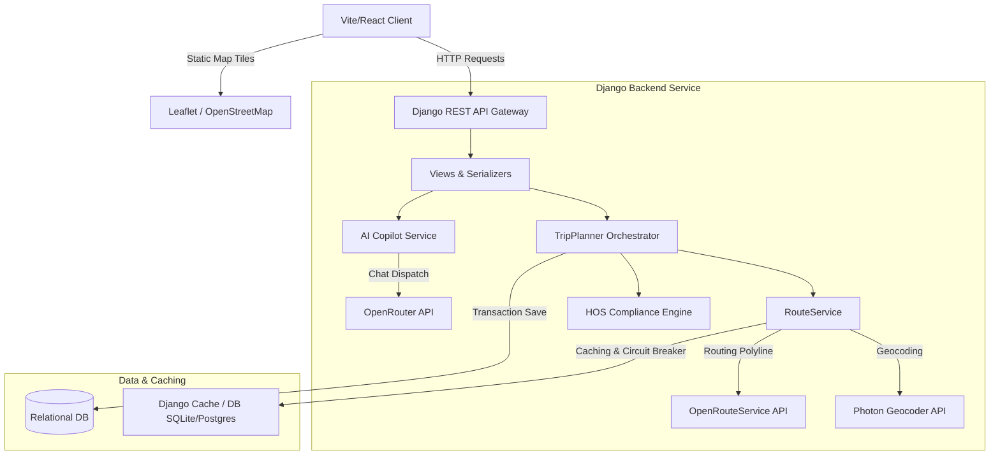
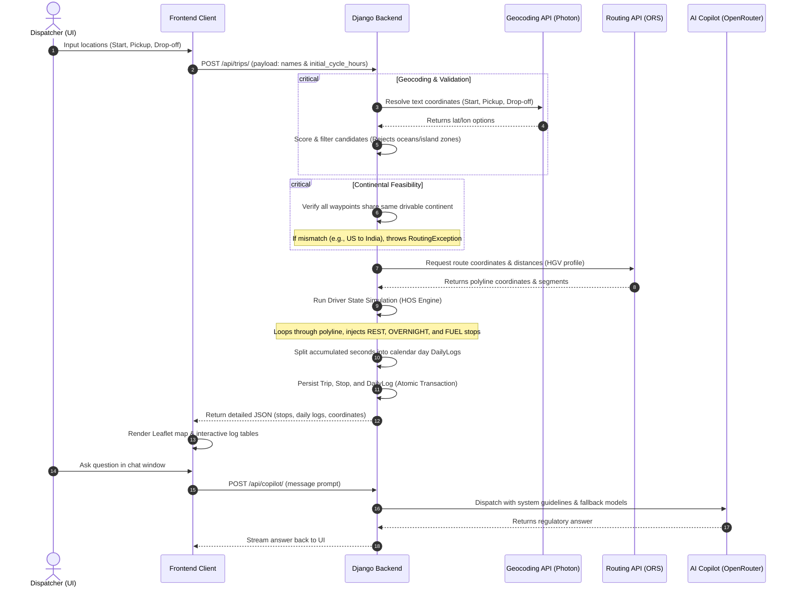

# 🚛 Aura HOS - AI-Assisted Trucking Dispatch & FMCSA Hours-of-Service Planner

[](https://react.dev/)
[](https://vitejs.dev/)
[](https://tailwindcss.com/)
[](https://leafletjs.com/)
[](https://djangoproject.com/)
[](https://www.django-rest-framework.org/)
[](https://vercel.com/)
[](https://render.com/)

Aura HOS is a production-grade, compliance-aware route optimization and dispatch platform designed for commercial freight logistics. It integrates real-time route geometry rendering with a high-fidelity simulation engine that enforces FMCSA (Federal Motor Carrier Safety Administration) Hours-of-Service (HOS) rules. Additionally, Aura HOS features a multi-model fallback AI Copilot to assist dispatchers and operators in auditing logs, understanding FMCSA guidelines, and mitigating operational risks.

---

## 📌 Table of Contents
1. [📖 Project Overview](#-project-overview)
2. [⚠️ Problem Statement](#️-problem-statement)
3. [💡 Why Aura HOS Matters](#-why-aura-hos-matters)
4. [🛠️ Feature Breakdown](#️-feature-breakdown)
5. [🏗️ Technical Architecture](#️-technical-architecture)
6. [🔄 System Workflow](#-system-workflow)
7. [🎨 Frontend Engineering Decisions](#-frontend-engineering-decisions)
8. [⚙️ Backend Engineering Decisions](#️-backend-engineering-decisions)
9. [🤖 AI Assistant Architecture](#-ai-assistant-architecture)
10. [🛡️ Edge-Case & Error Validation](#️-edge-case--error-validation)
    - [Geographical Contradiction Rejection](#geographical-contradiction-rejection)
    - [Ocean & Marine Region Rejection](#ocean--marine-region-rejection)
    - [Continental Separation Rejection](#continental-separation-rejection)
    - [Geocoding Suggestion Scoring Heuristics](#geocoding-suggestion-scoring-heuristics)
11. [🔌 API Fallback & Offline Simulation](#-api-fallback--offline-simulation)
12. [📈 Scalability Discussion](#-scalability-discussion)
13. [🔒 Security Considerations](#-security-considerations)
14. [🚀 Deployment Architecture](#-deployment-architecture)
15. [📂 Folder Structure](#-folder-structure)
16. [💻 Local Setup Instructions](#-local-setup-instructions)
17. [🔑 Environment Variables](#-environment-variables)
18. [📸 Screenshots & Demo](#-screenshots--demo)
19. [🔮 Future Scope](#-future-scope)
20. [👥 Contributors](#-contributors)
21. [📄 License](#-license)

---

## 📖 Project Overview

Commercial logistics relies heavily on trucking, but planning long-haul freight corridors is traditionally manual and prone to regulatory violations. Aura HOS bridges this gap by automatically parsing origins, pickups, and drop-offs to calculate legal driving itineraries.

Rather than plotting direct routes, Aura HOS simulates driving time, automatically injecting **30-minute rest breaks**, **10-hour overnight resets**, and **vehicle refueling stops** based on physical odometer progress and elapsed duty hours. 

---

## ⚠️ Problem Statement

Commercial truck drivers in the United States operate under strict FMCSA safety rules designed to prevent driver fatigue. Violations incur heavy carrier fines and increase accident liabilities. However, planning compliant routes is exceptionally difficult for dispatchers because:
- **Duty-Window Constraints**: Loading and unloading dwell times at shipping yards count as "On-Duty, Non-Driving" time, actively depleting the driver's daily 14-hour duty clock.
- **Dynamic Routing Realities**: Standard map APIs calculate travel times but ignore mandatory driver rest periods, leading to inaccurate Estimated Times of Arrival (ETAs).
- **Erroneous Log Inputs**: Inputting island locations (e.g. Hawaii) or mixing up states (e.g. Dallas, Gujarat) can crash routing APIs or generate non-feasible transit paths.

---

## 💡 Why Aura HOS Matters

By automating compliance checks, Aura HOS changes how dispatchers plan loads:
1. **Accurate ETAs**: By simulating HOS breaks, dispatchers see when the cargo will *actually* arrive, factoring in sleep, loading delays, and refueling.
2. **Reduced CSA Score Risks**: Carriers are evaluated on HOS Compliance. Pre-planning routes around verified truck stops ensures drivers do not violate their daily driving limits.
3. **Optimized Driver Shifts**: Dispatchers can specify the driver's starting cycle hours to utilize remaining legal driving limits safely.

---

## 🛠️ Feature Breakdown

- **Intelligent Route Planning**: Resolves routing paths across multiple waypoints (Start ➔ Pickup ➔ Drop-off) via OpenRouteService (ORS).
- **HOS Compliance Simulation**: Evaluates driver progress minute-by-minute, applying:
  - **11-Hour Driving Limit**: Prevents driving after 11 cumulative hours.
  - **14-Hour Duty Limit**: Flags overnight reset requirements after 14 hours of combined duty.
  - **8-Hour Driving Limit (30-Min Rest)**: Enforces a 30-minute off-duty break before exceeding 8 hours of continuous driving.
- **Stop Location Generation**: Interpolates precise coordinates along the route polyline to spawn scheduled rest stops, overnight resets, and refueling breaks.
- **Daily Compliance Logs**: Generates formatted, audit-ready summaries dividing every 24-hour cycle into Driving, On-Duty, and Off-Duty seconds.
- **Geological Integrity Filters**: Reject ocean locations, island boundaries, and continental crossings (e.g., trying to drive from Seattle to Mumbai).
- **AI Operational Assistant**: A domain-specific copilot specializing in FMCSA Title 49 CFR, helping dispatchers evaluate route compliance and safety strategies.

---

## 🏗️ Technical Architecture

Aura HOS utilizes a decoupled client-server architecture. The frontend handles coordinate visualization and interface states, while the backend hosts the core HOS logic, geocoding resolvers, database CRUD operations, and AI service orchestration.



---

## 🔄 System Workflow

Here is the flow of operations when a dispatcher plans a new trip:



---

## 🎨 Frontend Engineering Decisions

1. **Vite + React (ES Modules)**: Selected over traditional Create React App (CRA) to ensure sub-second hot module replacement (HMR) and efficient production bundling.
2. **Vanilla TailwindCSS**: Leveraged for styling. Component states (e.g., light/dark toggles, routing errors, compliance alerts) map directly to tailwind utility classes, ensuring design consistency without heavy UI framework bloat.
3. **Leaflet.js Integration**: Used `leaflet` and `react-leaflet` to render map geometries locally. Polyline segments are mapped dynamically, coloring active transit legs in blue, and rendering custom markers for pickups, drop-offs, and compliance stops.
4. **Debounced Auto-Complete**: The origin and destination text fields hook into the backend geocoder. Search requests are debounced to avoid triggering unnecessary API queries on keystrokes.
5. **Decoupled Error Boundaries**: Custom React error boundaries isolate the Leaflet rendering window. If a map rendering exception occurs (e.g., invalid tile coordinates), the rest of the application remains functional.

---

## ⚙️ Backend Engineering Decisions

1. **Django + DRF**: Python was selected for the backend because it allows rapid modeling of complex, rule-based algorithmic structures (like HOS simulation) while offering Django REST Framework's (DRF) robust parsing, validation, and status handling.
2. **Database Integrity via `@transaction.atomic`**: Planning a trip creates a cascade of records: one `Trip`, multiple ordered `Stop` objects, and multiple `DailyLog` summaries. To prevent orphan records if a write fails, the entire calculation is executed inside an atomic transaction block.
3. **Photon Geocoding Wrapper**: The backend wraps Photon geocoding (`https://photon.komoot.io`), enabling fast autocomplete suggestions without commercial license costs. It applies a custom heuristic rating system (defined in `RouteService.score_suggestion`) to rank locations.
4. **Caching & Rate-Limit Circuit Breaker**: Geocoding query results and calculated polylines are cached in the Django cache framework. If the routing API returns a `429 Too Many Requests`, a circuit breaker flag `ors_rate_limited` is cached for 30 seconds, immediately short-circuiting downstream requests to prevent cascading application timeouts.

---

## 🤖 AI Assistant Architecture

The AI operational assistant helps operators navigate FMCSA rules directly from the dispatch dashboard. It is designed to be highly reliable, cost-efficient, and capable of operating offline:

1. **OpenRouter Orchestration**: The backend calls OpenRouter (`https://openrouter.ai/api/v1`), prioritizing lightweight, high-speed models (`openai/gpt-4o-mini`).
2. **Three-Model Failover Chain**: If the primary model times out or returns HTTP errors, the client attempts a fallback sequence:
   $$\text{Primary: GPT-4o-Mini} \longrightarrow \text{Fallback 1: Claude-3-Haiku} \longrightarrow \text{Fallback 2: DeepSeek-Chat}$$
3. **Premium Offline Matcher**: If the OpenRouter API key is missing or internet connectivity is completely lost, the backend uses a local rule-based regex parser. If queries mention standard keywords ("11-hour rule", "sleeper berth", "violations"), it returns pre-formulated, highly accurate legal references, ensuring the assistant is never completely offline.
4. **Strict System Prompt Constraint**: System guidelines enforce compliance-centric context. The chatbot will refuse to answer non-logistics queries (e.g. coding help, writing tasks) and limits response lengths to 3–6 sentences.

---

## 🛡️ Edge-Case & Error Validation

A major challenge in route planning is validating input data before calling external services. Aura HOS implements multiple custom filtering algorithms:

### Geographical Contradiction Rejection
Drivers occasionally mistype destinations, combining conflicting geographic keywords. The `validate_geographic_combination` function checks for contradictory keywords:
- If a query contains both US indicators (e.g., "Texas", "CA", "Seattle") and India indicators (e.g., "Gujarat", "Mumbai", "Delhi"), the query is rejected with a `GeocodingException` before calling the geocoder, saving API quotas.

### Ocean & Marine Region Rejection
If a geocoded coordinate falls into water bodies (e.g. Atlantic or Pacific Ocean bounds), it is identified by the `is_in_ocean` method. The backend blocks routing requests to these points, preventing routing errors.

### Continental Separation Rejection
The backend prevents impossible "over-land" routing requests between disconnected regions:
- The `get_drivable_continent` function maps coordinates into zones: `"north_america"`, `"india"`, `"europe"`, `"australia"`, `"hawaii"`, or `"ocean"`.
- If a dispatcher requests a route between different zones (e.g., Dallas to Munich), the backend throws an exception explaining that no commercial trucking corridor connects these points.

### Geocoding Suggestion Scoring Heuristics
Autocomplete results are sorted using a multi-factor weighting formula:
$$\text{Score} = \text{Text Match Boost} + \text{Photon Rank Decay} + \text{Administrative Level Weight} + \text{Logistics Term Boost}$$

- **Logistics Term Boost (+800)**: Coordinates containing terms like "port", "hub", "logistics", "terminal", "warehouse", or "yards" are boosted.
- **Obscure Detail Deprioritization (-2500)**: Minor residential buildings, highways, and street addresses are heavily deprioritized in favor of cities and major logistics hubs.

---

## 🔌 API Fallback & Offline Simulation

To support offline demonstrations, local development, and sandboxed testing without active API keys:

1. **High-Fidelity Mock Database**: A curated database of major cities in the US, India, Germany, Australia, and Canada is stored in `RouteService.MOCK_DATABASE`.
2. **Deterministic Route Generator**: If the ORS API key is missing or rate limits are hit, the system generates a simulated route. It interpolates points between the waypoints, adding a sine-wave mathematical "wiggle" to emulate highway bends, and calculates travel times based on commercial truck speeds (55 mph / 88.5 km/h).
3. **Validation Enforcements**: Even fallback routes run through full HOS limits and continent-crossing validations.

---

## 📈 Scalability Discussion

To scale Aura HOS to support fleet dispatching for thousands of active trucks:

- **Asynchronous Planning Pipeline**: Heavy routing operations and simulation loops can be moved out of the synchronous request-response cycle. Utilizing **Celery** with **Redis** as a broker would allow dispatchers to submit batches of trips and poll status via WebSockets.
- **Spatial Indexes**: Transitioning the database from SQLite to **PostgreSQL with PostGIS** would allow geographic validations (like ocean checks and continent zones) to run directly on the database level using fast spatial indexing.
- **Vector Map Tile Hosting**: Instead of pulling map tiles from open servers, a production deployment would host custom map tiles on an enterprise CDN (e.g., Mapbox or local Vector tile server) to reduce latency and control network costs.

---

## 🔒 Security Considerations

- **API Key Isolation**: Sensitive API credentials (ORS, OpenRouter, Django Secrets) are injected into the container environment and never exposed to the frontend client.
- **Strict CORS Origin Whitelisting**: Django's middleware is configured to only allow requests from the designated frontend domain (e.g., Vercel origin) in production mode.
- **Input Sanitization**: Waypoints and input fields are validated using DRF Serializers, checking for coordinate bounds ($[-90, 90]$ for latitude, $[-180, 180]$ for longitude) and escaping text inputs to prevent script injection.

---

## 🚀 Deployment Architecture

Aura HOS is configured for automated CD (Continuous Deployment) environments:

```
[ Frontend: React / Vite ] ➔ Deployed on Vercel
   └─ Single Page Application serving static JS/CSS
   └─ Rewrites configuration (vercel.json) directing api calls to Render

[ Backend: Django REST ] ➔ Deployed on Render
   └─ WSGI HTTP server managed by Gunicorn (Procfile)
   └─ Whitenoise middleware compiling and serving Django Admin static assets
   └─ SQLite database (default for demos) or external PostgreSQL addon
```

---

## 📂 Folder Structure

```
.
├── Frontend/                 # React Frontend Application (Vite)
│   ├── src/
│   │   ├── components/       # Reusable UI widgets
│   │   │   ├── AutocompleteInput.jsx   # Debounced location geocoder input
│   │   │   ├── ErrorBoundary.jsx       # Isolated React error boundaries
│   │   │   ├── HOSLogs.jsx             # Daily log grid display
│   │   │   ├── MapExperience.jsx       # Leaflet Map container & polylines
│   │   │   ├── Navbar.jsx              # Global navigation bar
│   │   │   ├── RouteResults.jsx        # Trip stats & stop list
│   │   │   └── ThemeToggle.jsx         # Dark/Light mode theme switch
│   │   ├── context/          # Global theme and state context
│   │   ├── pages/            # Application view pages
│   │   │   ├── LandingPage.jsx         # Marketing & demo portal
│   │   │   ├── PlannerPage.jsx         # Main planning workspace
│   │   │   └── DailyLogVisualizer.jsx  # Audit visualizer for compliance
│   │   ├── services/         # Axios API backend client
│   │   ├── App.jsx           # Main router & layout configuration
│   │   ├── index.css         # Tailwind directives & custom global CSS
│   │   └── main.jsx          # DOM rendering entrypoint
│   ├── package.json          # Frontend dependencies (Leaflet, Lucide, Framer Motion)
│   ├── tailwind.config.js    # Tailwind layout utility customization
│   ├── vercel.json           # Vercel deployment routing rewrites
│   └── vite.config.js        # Vite build tool setup
│
├── backend/                  # Django Backend Application
│   ├── config/               # Django root settings and WSGI configs
│   ├── trips/                # Main application app for route calculations
│   │   ├── migrations/       # Database schema migrations
│   │   ├── services/         # Core business logic layer
│   │   │   ├── copilot_service.py # OpenRouter AI chat & offline fallbacks
│   │   │   ├── hos_service.py     # FMCSA rule models & driver state
│   │   │   ├── route_service.py   # Geocoder wrapper & feasibility filters
│   │   │   └── trip_planner.py    # Simulation runner & database transaction
│   │   ├── models.py         # Trip, Stop, and DailyLog schemas
│   │   ├── serializers.py    # DRF request/response formatting
│   │   ├── views.py          # API endpoints & geocoding controllers
│   │   └── tests.py          # Test suite verifying HOS rules & fallbacks
│   ├── requirements.txt      # Backend Python dependencies
│   ├── Procfile              # Render production server launch script
│   └── manage.py             # Django admin command-line tool
│
├── .gitignore                # Root-level ignore file (Vite, Python, Django, OS)
└── .env.example              # Consolidated environment template
```

---

## 💻 Local Setup Instructions

Follow these steps to run the complete stack locally on your computer.

### Backend Setup

1. **Navigate to the backend directory**:
   ```bash
   cd backend
   ```

2. **Create and activate a virtual environment**:
   ```bash
   python3 -m venv venv
   source venv/bin/activate
   # For Windows Power Shell: .\venv\Scripts\Activate.ps1
   ```

3. **Install python packages**:
   ```bash
   pip install --upgrade pip
   pip install -r requirements.txt
   ```

4. **Run migrations to set up local database**:
   ```bash
   python manage.py migrate
   ```

5. **Start the Django development server**:
   ```bash
   python manage.py runserver
   ```
   *The backend will be running at `http://127.0.0.1:8000/`*

---

### Frontend Setup

1. **Open a new terminal window and navigate to the Frontend directory**:
   ```bash
   cd Frontend
   ```

2. **Install Node.js dependencies**:
   ```bash
   npm install
   ```

3. **Create your local environment file**:
   ```bash
   echo "VITE_API_URL=http://127.0.0.1:8000/api" > .env
   ```

4. **Launch the Vite development server**:
   ```bash
   npm run dev
   ```
   *The frontend dashboard will be running at `http://localhost:5173/`*

---

## 🔑 Environment Variables

To operate in live mode, ensure the following keys are provided in `backend/.env`:

```env
# OpenRouteService API Key (live map routes)
OPENROUTE_SERVICE_API_KEY=your_key_here

# OpenRouter API Key (live AI assistant)
OPENROUTER_API_KEY=your_key_here
```
*If these variables are omitted, the backend will automatically activate offline simulator mode for geocoding, routing, and AI responses.*

---

## 📸 Screenshots & Demo

### Interactive Dispatch Dashboard
Below is a visual overview of the Aura HOS routing workspace.

```
+--------------------------------------------------------------------------------+
|  [Logo] Aura HOS   | Trip Planner | Compliance Audit | Assistant      [Dark]   |
+------------------------------------+-------------------------------------------+
| Route Input Configuration          | Map Live Route View                       |
|                                    |                                           |
| Origin: [ Seattle Port, WA       ] |     +-----------------------------+       |
| Pickup: [ Chicago Yards, IL      ] |     |                             |       |
| Dropoff:[ Dallas Logistics, TX   ] |     |         Route Line          |       |
|                                    |     |   (Seattle -> Chi -> Dal)   |       |
| Starting Cycle Hours: [ 0.0     ]  |     |                             |       |
|                                    |     |  [Stop 1]  [Stop 2]  [Stop 3] |       |
| [ PLAN COMPLIANT ROUTE ]           |     +-----------------------------+       |
+------------------------------------+-------------------------------------------+
| Active Trip Statistics:                                                        |
| Distance: 2,845.2 Miles  | Duration: 62.4 Hours (Compliance Stops Included)    |
+--------------------------------------------------------------------------------+
| Compliance Stop Itinerary                                                      |
| #1. [START]  Seattle Port, WA     - Arr: 10:00 AM | Dep: 10:00 AM | Dist: 0.0mi|
| #2. [REST]   HOS 30-min break     - Arr: 06:00 PM | Dep: 06:30 PM | Dist: 440mi|
| #3. [RESET]  HOS 10-hr Overnight  - Arr: 12:30 AM | Dep: 10:30 AM | Dist: 720mi|
+--------------------------------------------------------------------------------+
```

*Place actual screenshot image links here during production deployment:*
- ``
- ``

---

## 🔮 Future Scope

1. **Split-Sleeper Berth Automation**: Full support for 8/2 and 7/3 split sleeper-berth duty window pauses under FMCSA § 395.1(g).
2. **Weather & Terrain Overlays**: Injecting live weather radar and mountain pass elevations to dynamically adjust estimated truck speeds and increase safety.
3. **Live ELD API Sync**: Syncing directly with Electronic Logging Devices (e.g. Samsara or Motive) to pull real-world driver clocks automatically.
4. **Multi-Truck Convoy Planning**: Bundling route requests for multiple trucks traveling along the same corridor to maximize fuel stop utilization.

---

## 👥 Contributors

- **Rutva Patel** - *Core Architecture, Route Simulation Algorithm, Frontend Dashboard & AI Copilot Integration*

---

## 📄 License

This project is licensed under the MIT License - see the [LICENSE](LICENSE) file for details.
